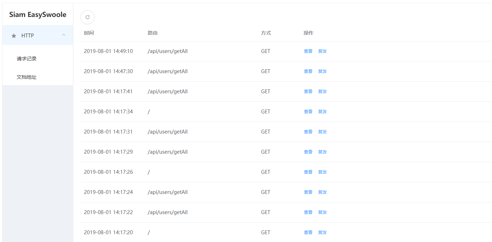
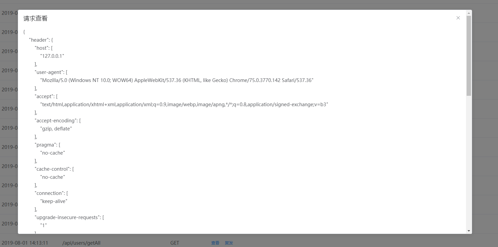
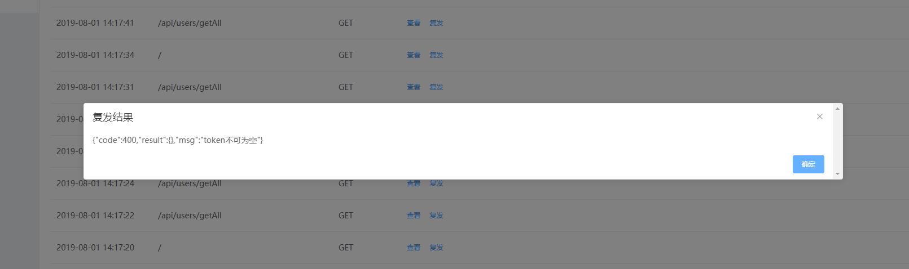

# HTTP监控复发工具

在开发接口阶段，可以记录最近的http请求，并且分析参数、复发请求，

特别是在微信支付等异步回调的场景，调试非常舒爽。

作者 Siam 

QQ 59419979

可在easyswoole官方1群、2群(管理员)找到我

# 使用场景

记录监听近期的HTTP请求参数，可以手动选择复发。

在接口调试阶段，比较有用，特别是微信支付异步回调等场景。

假设我们有一个接口的参数需要从前面两个接口获得，并且在短期内可以重复使用

当我们在调试过程发现这个接口出bug，我们直接在HttpMonitor面板中点击复发，即可看到结果，进行调试，再复发，再复发，再复发。。。直到程序修复

支付成功异步回调就不说了，每一次都要你从手机付款一笔  微信才回调，然后你打Log，再调整程序。

同上，我们可以同一个订单，一直复发，调试程序，直到所有流程跑通。再线上真机测试。

# 截图演示








# 使用教程

安装

```
composer require siam/easyswoole-http-monitor
```

mainServerCreate方法注册
```

use Siam\HttpMonitor\Config as HttpConfig;
use Siam\HttpMonitor\Monitor;

$config = new HttpConfig([
    'size'      => 20, //最大缓存数量
    'listUrl'   => '/siam/http-monitor/get_list',
    'resendUrl' => '/siam/http-monitor/resend',
]);

$monitor = Monitor::getInstance($config);
    
// 添加白名单 无需记录
$monitor->addFilter('/siam/http-monitor/get_list');
$monitor->addFilter('/favicon.ico');
$monitor->addFilter('/siam/http-monitor');
$monitor->addFilter('/siam/http-monitor/resend');
```


添加路由支持
```

use Siam\HttpMonitor\Config;
use Siam\HttpMonitor\Monitor;

// 主页面
$routeCollector->get('/siam/http-monitor', function (Request $request, Response $response) {
    $monitor = Monitor::getInstance();
    $html = $monitor->listView();
    $response->withHeader('Content-type','text/html;charset=utf-8');
    $response->write("$html");//获取到路由匹配的id
    return false;//不再往下请求,结束此次响应
});

// 获取历史列表
$routeCollector->addRoute(['POST', 'GET'], '/siam/http-monitor/get_list', function (Request $request, Response $response) {
    $response->withHeader('Content-type','text/html;charset=utf-8');
    $response->write(Monitor::getInstance()->getList());//获取到路由匹配的id
    return false;//不再往下请求,结束此次响应
});

// 复发请求
$routeCollector->addRoute(['POST'], '/siam/http-monitor/resend', function (Request $request, Response $response) {
    $content = $request->getBody()->__toString();
    $content = json_decode($content, true);
    $response->write(Monitor::getInstance()->resend($content['id']));
    return false;//不再往下请求,结束此次响应
});

```


onRequest拦截
```
Monitor::getInstance()->log([
    'header'     => $request->getHeaders(),
    'server'     => $request->getServerParams(),
    'get'        => $request->getQueryParams(),
    'post'       => $request->getParsedBody(),
    'cookie'     => $request->getCookieParams(),
    'files'      => $request->getUploadedFiles(),
    'rawContent' => $request->getBody()->__toString(),
    'data'       => $request->getSwooleRequest()->getData(),
]);
```
